# Canva Grow 营销内容合规层 PRD

> 让品牌在 Canva 中更快生成、修复并发布可解释的合规营销内容。

| 文档属性 | 内容 |
|---|---|
| Owner | AI Product · Risk & Compliance |
| 状态 | Draft for alignment |
| 版本 | v0.9 |
| 日期 | 2026-08-30 |
| P0 范围 | Australia · Beauty · Text |

## 项目对 Canva 的价值

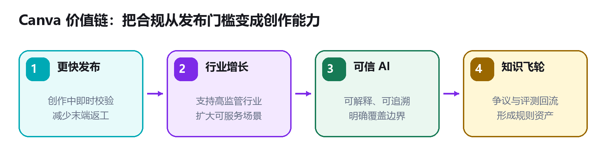

| 价值方向 | 对 Canva 的意义 | 产品抓手 |
|---|---|---|
| 更快发布 | 减少发布前的末端返工和人工等待 | 创作中即时检查、一键修复、自动重检 |
| 行业增长 | 支持 Beauty 等高监管行业，扩大 Canva Grow 可服务场景 | 市场化知识包与精确覆盖矩阵 |
| 可信 AI | 避免用户把“AI 生成”误认为“可合法发布” | 可解释结论、证据链和覆盖边界 |
| 知识复利 | 把争议、审核和评测沉淀为长期规则资产 | 版本化知识、回归评测与发布门禁 |

> **核心判断：**这不是独立法务工具，而是嵌入 Canva Grow 创作—发布链路的决策层。能检查时给出可执行结果，不能检查时明确边界，并阻止错误的“可发布”暗示。

---

## 1. 文档信息与项目背景

### 1.1 产品定义

| 字段 | 内容 |
|---|---|
| 产品名称 | Canva Grow Compliance Layer（营销内容合规层） |
| 产品定位 | 创作时自动判断营销文案能否在当前覆盖范围内继续发布，并提供修复、追问或边界披露。 |
| 目标用户 | 品牌营销人员、中小企业主、代理商创作者；运营端为法规专家、内容政策与风险团队。 |
| 本期范围 | Australia · Beauty · Text；Cosmetic 与 AUST L Listed Medicine。 |
| 非目标 | 不替代法律意见；不声称覆盖 Meta 平台政策、图片、落地页或未发布市场知识包。 |

### 1.2 为什么现在做

| 用户旅程 | 当前断点 | 产品机会 |
|---|---|---|
| 生成文案 | AI 能写，但用户不知道是否满足市场和品类义务 | 生成后立即校验，问题与修复同屏 |
| 准备发布 | 合规常在末端介入，造成返工或等待 | 把必要声明、禁用表达和证据要求前移 |
| 跨市场复用 | 用户容易把局部规则误认为全市场覆盖 | 按国家 × 行业 × 产品 × 格式披露精确覆盖 |
| 规则变化 | 来源、规则、模型和界面解释容易漂移 | 知识包版本化，评测通过后才能发布 |

### 1.3 用户与 Jobs-to-be-done

| 角色 | 核心任务 | 成功体验 |
|---|---|---|
| 创作者 | 快速产出并发布广告文案 | 少跳转、问题清楚、能够一键修复 |
| 品牌/法务 | 控制违规风险与证据链 | 可追溯规则版本、来源和处理记录 |
| 知识运营 | 维护多市场合规知识 | 覆盖矩阵清晰，变更有审核和回归评测 |

> **前提假设：**本 PRD 以演示站点的 AU Beauty Text 能力为 P0 基线。所有控制台数字均为 Demo data，不代表 Canva 真实生产指标。

---

## 2. 产品目标、成功指标与优先级

### 2.1 产品目标

1. 在创作流程中正确理解营销内容和活动上下文。
2. 只调用已发布、处于有效期且适用范围明确的知识包。
3. 输出 Ready、Fix、Need input 或 Outside scope 的可解释结果。
4. 对可修复问题提供低成本修改路径，并在修改后重新检查。
5. 将争议、人工审核和线上错误回流到知识迭代流程。

### 2.2 北极星与护栏指标

| 指标 | 定义 | 试点建议目标* | 用途 |
|---|---|---:|---|
| 合规发布完成率 | 进入检查后，以有效 Ready 状态继续的会话占比 | 建立基线后提升 | 北极星 |
| 关键遗漏召回率 | 必填声明或明确禁用项被识别的比例 | ≥95% | 安全护栏 |
| 误拦截率 | 真实可用文案被判定为 Fix 的比例 | ≤8% | 体验护栏 |
| 覆盖披露率 | 每次结果展示 checked/not checked 的比例 | 100% | 透明度 |
| P95 决策耗时 | 从内容稳定到结果可用 | ≤4 秒 | 性能 |
| 修复后完成率 | 点击修复后通过重检并继续的比例 | ≥60% | 价值验证 |

\* PRD 阶段建议阈值，需通过影子模式和人工复核结果校准，不得作为现状数据对外传播。

### 2.3 范围优先级

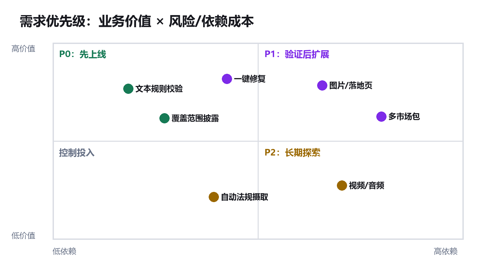

| 阶段 | 包含 | 明确不包含 |
|---|---|---|
| P0 | 文本校验、上下文补全、四态结果、修复与重检、覆盖披露、知识版本、争议及评测门禁 | 图片、落地页、Meta 平台政策 |
| P1 | 图片与落地页检查、平台政策包、多轮上下文、更多 AU 品类 | 自动扩展为所有市场 |
| P2 | 视频/音频、多市场自助接入、创作前预防式指导 | 无审核的自动法规发布 |

---

## 3. 核心体验：同屏检查、修复与边界说明

### 3.1 结果状态

| 结果状态 | 触发条件 | 用户动作 | 发布权限 |
|---|---|---|---|
| Ready to run | 上下文完整、范围受支持、未发现明确问题 | 查看证据与覆盖范围后继续 | 允许 |
| Fix before running | 发现必填缺失或明确风险表达 | 一键修复或手改后自动重检 | 阻止 |
| Need your input | 产品分类、证据或上下文不足 | 补充信息，不允许系统猜测 | 阻止 |
| Outside scope | 市场、行业、产品或格式不在已发布范围 | 查看未检查项和替代路径 | 不得输出绿色结论 |
| Error | 规则服务、模型或知识包暂时不可用 | 重试或进入人工路径 | 阻止 |

### 3.2 差异化结果示意

| 需修复：缺少强制声明 | 可发布：当前范围未发现明确问题 |
|---|---|
| 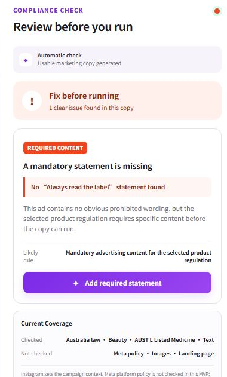 | 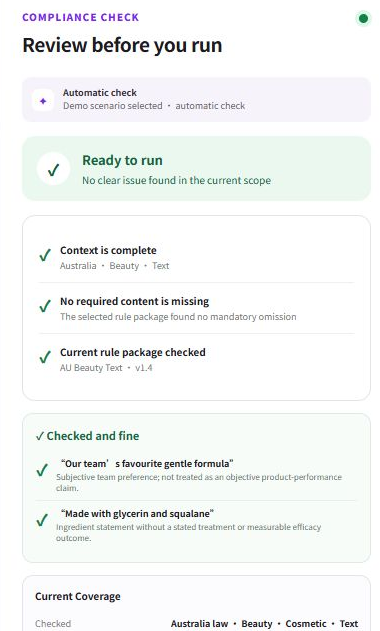 |

### 3.3 关键交互要求

| 模块 | 要求 | 验收信号 |
|---|---|---|
| 自动触发 | 内容或上下文稳定后检查；编辑即使旧结果失效并重新运行 | 旧结果不能继续使用 |
| 问题卡片 | 指出原文片段、问题类型、可能规则和下一步 | 用户无需离开画布理解问题 |
| Magic rewrite | 只修改必要片段，保留品牌语气，修改后自动重检 | 不把“完成改写”当作“检查通过” |
| 解释与反馈 | 展示 checked/not checked、知识版本和 trace_id；支持报告结果 | 决策可审计、争议可回流 |

---

## 4. 产品整体流程

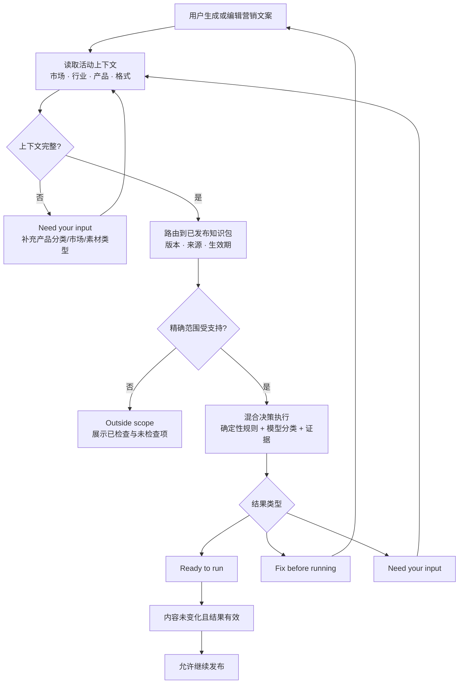

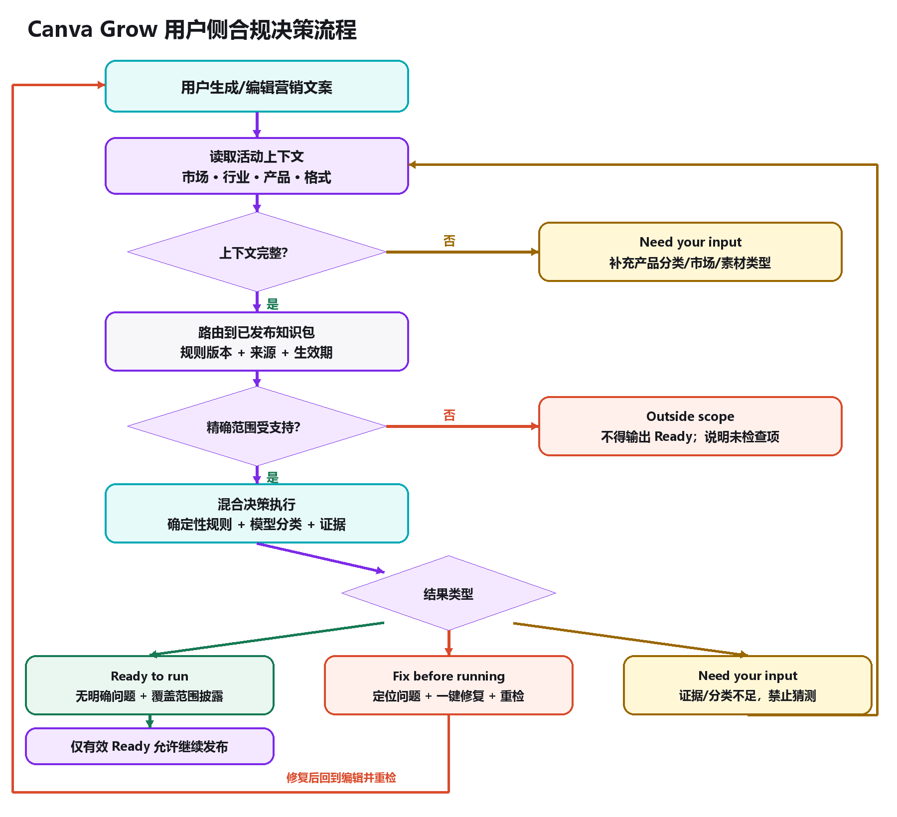

### 4.1 必须覆盖的异常

| 异常 | 系统行为 | 用户文案原则 |
|---|---|---|
| 意图或分类不确定 | 进入 Need your input，只提出最少必要追问 | 说明缺少什么，不假装确定 |
| 范围不支持 | 返回 Outside scope，列出 checked/not checked | 不使用“合规”“安全”等绝对措辞 |
| 服务或规则执行失败 | 结果失效并阻止继续，支持重试与人工路径 | 透明说明暂时不可用 |

---

## 5. 合规知识控制台与治理闭环

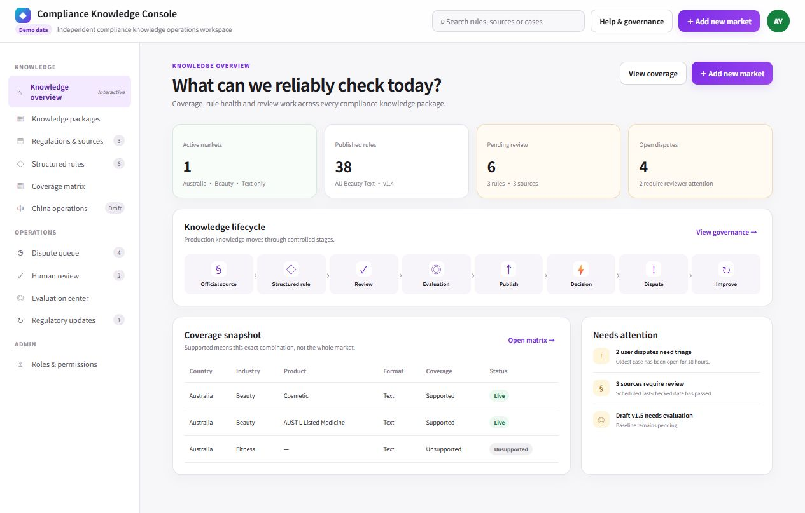

### 5.1 知识生命周期

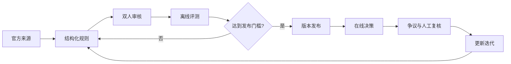

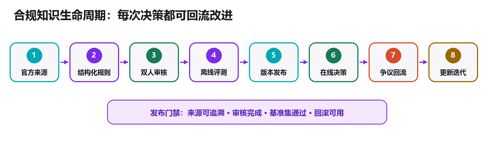

### 5.2 后台能力模块

| 模块 | 核心能力 | 关键权限 |
|---|---|---|
| 知识包 | 市场、行业、产品、格式组合；版本与生效期 | 知识管理员 |
| 来源与规则 | 来源快照、条款映射、结构化条件和结论 | 法规专家 |
| 审核与争议 | 双人复核、用户反馈、判例沉淀 | 审核员/法务 |
| 评测与发布 | 回归集、阈值、门禁和回滚 | 发布管理员 |

---

## 6. 覆盖矩阵与功能范围

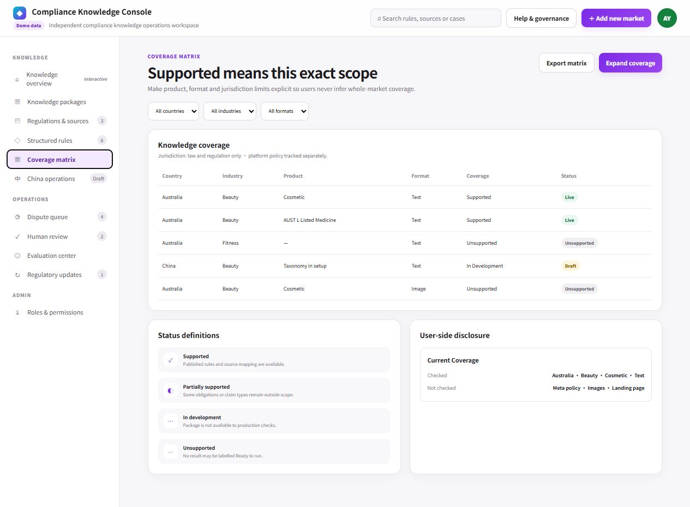

覆盖必须精确到 `Country × Industry × Product × Format`。用户侧必须同时显示 checked 与 not checked，避免将局部知识包误读为全市场覆盖。

### 6.1 P0 功能清单

| ID | 功能 | P0 验收标准 |
|---|---|---|
| F01 | 上下文采集 | 市场、行业、产品、格式至少可追溯；缺失时追问 |
| F02 | 知识包路由 | 只命中已发布且处于有效期的知识包版本 |
| F03 | 文本决策 | 输出 Ready、Fix、Need input 或 Outside scope 之一 |
| F04 | 问题定位与修复 | 返回问题片段、依据摘要和建议改法；修复后重检 |
| F05 | 覆盖披露 | 所有结果展示 checked/not checked 和知识版本 |
| F06 | 发布门禁 | 非有效 Ready 不得继续；内容变化立即使结果失效 |
| F07 | 决策日志 | 记录输入哈希、上下文、结果、版本、耗时和 trace_id |
| F08 | 争议反馈 | 用户可报告结果，反馈关联原始决策并进入争议队列 |

> **边界原则：**Unsupported 不是失败，而是可信产品的必要输出。任何未覆盖组合都不得通过通用模型生成绿色结论。

---

## 7. 系统架构与决策契约

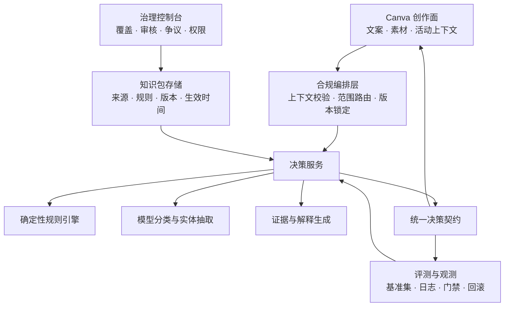

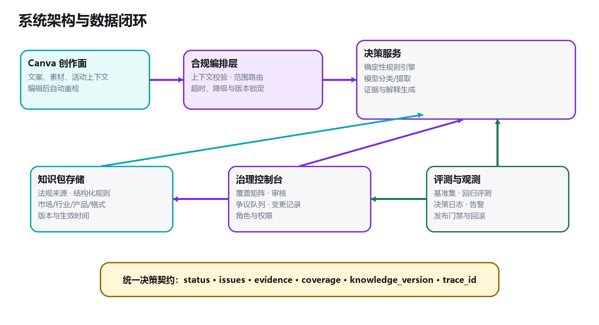

### 7.1 决策输出结构

| 字段 | 示例/规则 | 用途 |
|---|---|---|
| `status` | `READY / FIX / NEED_INPUT / OUTSIDE_SCOPE / ERROR` | 统一前端状态机 |
| `issues[]` | span、issue_type、severity、message、suggestion | 定位与修复 |
| `evidence[]` | source_id、rule_id、excerpt_hash、effective_at | 解释与审计 |
| `coverage` | checked、not_checked、jurisdiction、format | 边界披露 |
| `knowledge_version` | `AU-BEA-TEXT v1.4` | 决策重现与回滚 |
| `trace_id / latency` | 唯一链路 ID 和分阶段耗时 | 争议定位与观测 |

### 7.2 模型使用边界

| 适合由模型处理 | 必须由规则或知识决定 |
|---|---|
| 意图分类、实体抽取、原文片段定位、解释改写 | 法规是否生效、覆盖范围、强制声明、发布门禁、版本选择 |
| 对不完整表达提出澄清问题 | 不得用模型参数记忆替代官方来源或填补未知 |

---

## 8. 评测体系与发布门禁

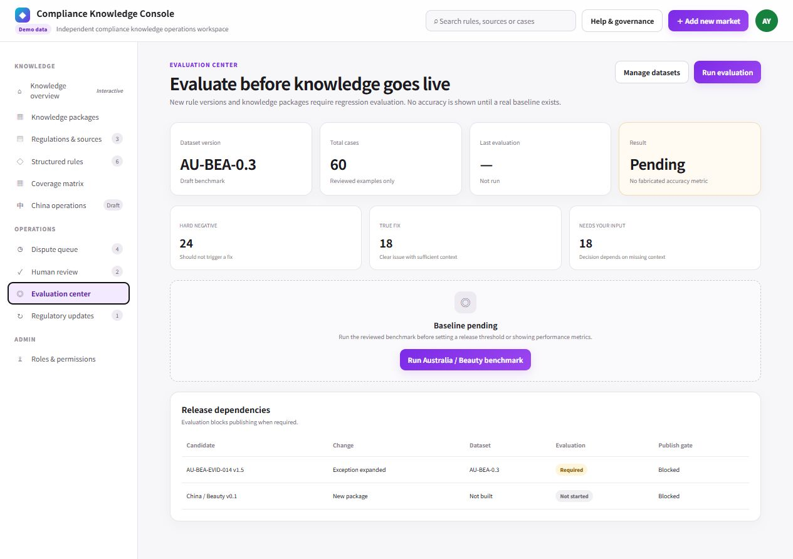

演示评测中心的原则是：未运行真实基准前不展示虚构准确率，知识包发布状态保持 Blocked。

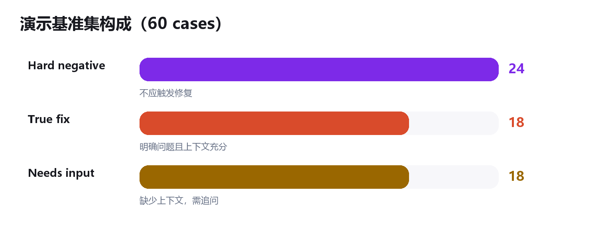

### 8.1 测试集构成

| 样本类型 | 演示数量 | 目的 |
|---|---:|---|
| Hard negative | 24 | 不应触发修复，用于控制误拦截 |
| True fix | 18 | 存在明确问题且上下文充分 |
| Needs input | 18 | 缺少上下文，系统应追问而不是猜测 |
| 合计 | 60 | Demo dataset `AU-BEA-0.3` |

### 8.2 核心评测维度

| 维度 | 指标 | 发布门禁 |
|---|---|---|
| 安全性 | 关键遗漏召回、严重违规漏放率 | 严重漏放为 0；召回达到知识包阈值 |
| 可用性 | 误拦截率、修复后通过率 | 不劣于当前生产版本 |
| 边界 | 缺上下文和不支持组合识别率 | 不得输出 Ready |
| 可解释 | 证据可追溯率、错误 rule_id 率 | 证据覆盖 100%，无错误映射 |
| 稳定性 | P95 延迟、超时率、版本一致性 | 满足 SLO，支持回滚 |

---

## 9. 上线计划、风险与依赖

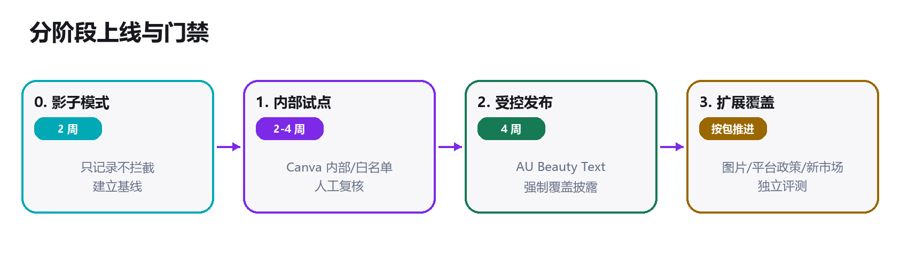

### 9.1 分阶段上线

| 阶段 | 建议周期 | 范围 | 退出门槛 |
|---|---:|---|---|
| 0. 影子模式 | 2 周 | 只记录、不拦截 | 建立人工复核基线和主要错误类型 |
| 1. 内部试点 | 2–4 周 | Canva 内部或白名单用户 | 关键安全门禁通过，运营流程跑通 |
| 2. 受控发布 | 4 周 | AU Beauty Text | 强制覆盖披露，监测误拦截与争议 |
| 3. 扩展覆盖 | 按知识包推进 | 图片、平台政策或新市场 | 每个知识包独立评测和发布 |

### 9.2 风险清单

| 风险 | 影响 | 控制措施 | Owner |
|---|---|---|---|
| 漏放严重违规 | 品牌与监管风险 | 强规则优先、关键召回门禁、人工复核抽样 | Risk + ML |
| 误拦截过多 | 发布转化下降 | Hard negative 集、分级严重度、可解释反馈 | Product |
| 规则过期 | 输出错误结论 | 来源 last-checked、到期告警、紧急下线和回滚 | Knowledge Ops |
| 覆盖误解 | 用户把局部能力当作全局 | 每个结果固定展示 checked/not checked | Design |
| 修复引入新问题 | 用户循环返工 | 修复后必重检，并限制修改范围 | ML |
| 争议积压 | 知识无法闭环 | SLA、优先级、判例复用与趋势告警 | Ops |
| 隐私和数据滥用 | 客户信任受损 | 最小化日志、内容哈希、访问控制和保留期 | Security |

### 9.3 关键依赖

| 依赖 | 进入 P0 前需要 |
|---|---|
| 法规与法务 | 确认 AU Beauty Text 的官方来源、适用范围和免责声明 |
| Canva Grow | 提供活动上下文、编辑事件、发布门禁和版本状态 |
| 数据/ML | 建立经专家标注的基准集和错误分级 |
| 平台/安全 | 决策日志、访问控制、告警、回滚和数据保留策略 |

---

## 10. 验收标准与待决问题

### 10.1 P0 端到端验收

| 场景 | Given / When | Then |
|---|---|---|
| 缺少必填声明 | AUST L 文案缺少 mandatory statement | 返回 Fix；定位缺失；可一键补充；重检后才能继续 |
| 产品分类未知 | 用户未提供 Cosmetic 或 Listed Medicine | 返回 Need input，不选择默认分类 |
| 范围不支持 | AU Fitness Text 或 Cosmetic Image | 返回 Outside scope；列出未检查项；不显示 Ready |
| 检查通过 | AU Cosmetic Text 且无明确问题 | 显示 Ready、覆盖范围、规则版本和解释；内容变化后失效 |
| 系统失败 | 规则服务超时或知识包不可用 | 返回 Error；阻止继续；支持重试和人工路径 |
| 用户争议 | 用户报告错误结果 | 争议记录包含 trace_id、内容哈希、上下文和知识版本 |

### 10.2 立项前必须回答

| 问题 | 建议决策 |
|---|---|
| P0 是否硬阻断发布？ | 只对高置信强制义务硬阻断，其余按风险等级和市场策略处理 |
| 谁拥有规则最终解释权？ | 法规专家负责规则，产品负责体验，发布管理员负责上线门禁 |
| 哪些内容可以用于模型改进？ | 默认不使用客户原文训练，只在明确授权和去标识后进入数据集 |
| 如何表述 Ready？ | 固定附带“在当前已检查范围内”和 not checked 列表 |
| 首个真实试点群体？ | 建议 AU Beauty 内部或白名单品牌，先影子模式再受控发布 |

## 文档依据

- 结构与篇幅参考：《AI工具助手PRD.pdf》（11 页）。
- 产品界面依据：Canva Grow Compliance Demo、Compliance Knowledge Console。
- 访问日期：2026-08-30。
- 控制台数值标注为演示数据，不代表 Canva 生产指标。

> **最终建议：**以 AU Beauty Text 为最小可信闭环，先证明“能准确识别边界、能修复、能解释、能回流”，再扩展图片、平台政策和新市场。
